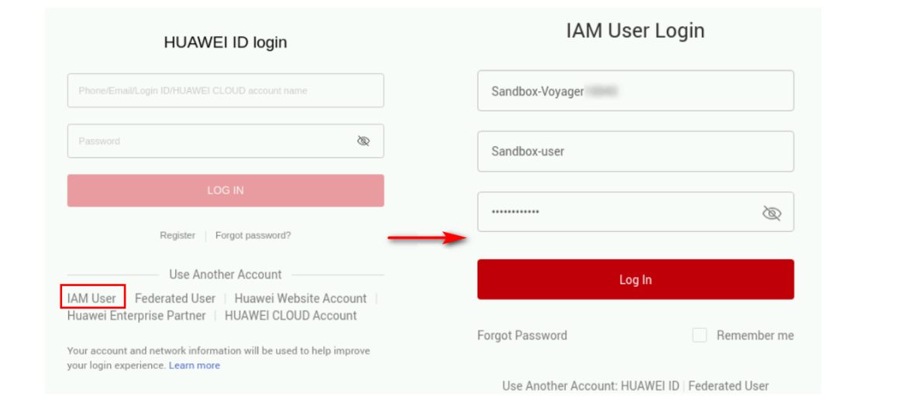

# LAB : Deploying an Enterprise Web
An enterprise intends to deploy their website on HUAWEI CLOUD and they have the 
following requirements:
1.Database nodes and service nodes are deployed on separate ECSs.
2.ECSs are added or removed as incoming traffic changes over time.
# Prerequisites:
Log in to HUAWEI CLOUD.Go to the [Lab Desktop] and open the Google 
Chrome browser to access the HUAWEI CLOUD login page. Select IAM User Login. In the 
login dialog box, enter the assigned HUAWEI CLOUD lab account and password to log in to 
HUAWEI CLOUD.

# 1.Tasks
1.1 Creating a VPC
Step 1 Switch to the management console, and select the AP-Singapore region. In the left 
navigation pane, choose Service List > Networking > Virtual Private Cloud.
Step 2 Click Create VPC.

Step 3 Configure the parameters as follows, and click Create Now.

● Region: AP-Singapore

● Name: vpc-mp (Change it as needed.)

● Retain the default settings for other parameters.

Step 4 View the created VPC in the VPC list.

# 1.2 Creating and Configuring a Security Group

Step 1 On the Network Console, choose Access Control > Security Groups and create a 
security group.

Step 2 Click the security group name.
Step 3 Click Inbound Rules and then Add Rule to add an inbound rule with the following 
parameter settings:

● Protocol & Port: All

● IP address in Source: 0.0.0.0/0

# 1.3 Buying an ECS
Step 1 In the service list, choose Compute > Elastic Cloud Server.

Step 2 Click Buy ECS and set the following parameters.
Basic settings:

● Billing Mode: Pay-per-use

● Region: AP-Singapore

● AZ: Random

● CPU Architecture: x86

● Specifications: General computing, s6.small.1 1 vCPUs | 1 GB

● Image: Public image, CentOS 7.6 64bit (40 GB)

● System Disk: High I/O, 40 GB

Network configuration:

● Network: Select the VPC you have created.

● Security Group: Select the security group you have created.

● EIP: Auto assign, Dynamic BGP, Billed by Bandwidth, 2 Mbit/s
